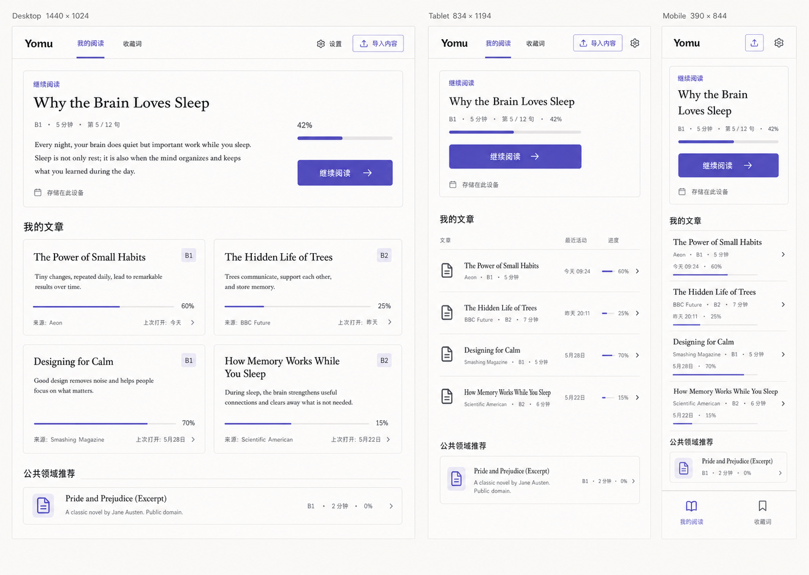

# Yomu v2 产品升级 Spec

> 状态：Approved（产品方向与响应式视觉于 2026-08-01 确认）｜基线：`727d116`（2026-07-31）｜产品适用面：Web / PWA、桌面与移动，英文阅读，本机优先｜发布策略：v2 先交付 Web / PWA，全平台 UI 与架构契约从 v2 起生效｜目标读者：产品、设计、前端、测试

## 0. 决策摘要

Yomu v2 的唯一产品主线是：

> **把用户自己的英文内容收进本机阅读库，通过逐句朗读和按需辅助完成一次专注阅读，再进行轻量的读后回顾。**

核心闭环：

```text
我的阅读库
  ├─ 继续上次阅读
  ├─ 导入：粘贴 / 文本文件 / URL Beta → 导入预览
  └─ 没有材料：Today / 公共领域样例 ─────┐
                                          ↓
                                     专注阅读器
   正文 + 进度 + 朗读 + 按需选词
          ↓
       读后回顾
   完成摘要 + 本文候选词 + 收藏词
```

锁定以下取舍：

1. 首页从单篇 `Today` 改为“我的阅读”；Today 降为推荐入口，不再决定产品结构。
2. v2 做“读后回顾”，不把它包装成完整的记忆或复习系统。
3. Web Speech、纯阅读、选词和收藏是零 Key 基线；本地释义按现有词典能力提供但不承诺覆盖率，MiMo 与 AI 是可选增强。
4. 阅读器只承载阅读动作；API Key、Provider 配置和隐私说明进入统一设置。
5. Web / PWA 的正文、阅读进度和词汇实体迁移到带版本的 IndexedDB；`localStorage` 不再保存文章正文，只保留轻量偏好和用户明确要求记住的 BYOK。feature 通过 repository 契约访问这些数据，为后续壳存储留出替换边界。
6. v2 仅支持英文；不承诺导入后自动获得翻译、IPA 或完整词义。
7. 已批准的视觉方向为：Expanded 桌面采用双列文章卡片，Medium 平板与 Compact 手机采用高效文章列表；三档共用同一内容顺序、状态模型和组件语义。
8. 全平台采用“共享 Vue UI 核心 + 薄 WebView 应用壳”的路线；页面、feature、领域模型和 `@ayingott/theme` 在 Web、PWA、桌面壳与移动壳中复用，不维护第二套原生界面。
9. “全平台”表示同一产品在 Web、iOS、Android、macOS、Windows 和 Linux 可用，不表示账号、云同步或跨设备连续阅读；每个浏览器 profile 或应用安装仍是独立的本机数据域。

本 Spec 自 2026-08-01 起成为 v2 的产品、交互与全平台适配主规格。现有 `reading-interaction-spec-v1.md`、`read-expansion-spec-v1.md` 和 V0 spike 保留为历史记录，不再作为新需求依据。

## 1. 为什么不是继续修现有页面

当前版本已经具备不少可靠的底层能力：

- Web Speech 与 MiMo BYOK 逐句朗读；
- 当前句高亮、暂停、跳句、速度和预取；
- 本地查词、显式收藏和本地读后抽词；
- 粘贴、TXT/Markdown、URL 导入管线及 SSRF 防护；
- Today 缓存、离线状态和三档公共领域兜底；
- 明确的云端同意、本地优先策略和较完整的自动化测试。

问题不在于“功能太少”，而在于这些能力没有被组织成一个一致的产品：

- 文档定位是个人阅读库，实际首页仍只有 Today 单篇；
- 导入和阅读库存储已经存在，但没有任何用户界面；
- `App.vue` 同时编排文章加载、页面切换、播放器、查词、收藏、TTS、AI、同意和完成状态；
- TTS/AI 设置直接插入阅读流，打开后会改变正文位置且缺少独立关闭边界；
- 完成区追加在整篇文章后面，阅读、设置和回顾没有真正分成页面；
- 词汇只保存全局 token ID，导入文章之间可能发生 ID 冲突，也无法可靠回到原句；
- URL 导入当前主要是去标签，不是可靠的正文抽取；
- 导入文章通常没有翻译、IPA 或词义，现有控件不能假设这些能力总是存在。

因此，v2 是一次产品结构与状态模型升级，不是视觉换肤。

## 2. 现状体验审计

### 2.1 方法和边界

审计基于基线 commit 的本地运行版本，手动走查 Today → 阅读 → 辅助显示/查词 → 设置 → 完成流程，并检查相关 DOM 语义和实现代码。

本次未包含真实 MiMo/OpenAI 联调、屏幕阅读器实测、量化对比度检测、Firefox/WebKit 实机和正式用户访谈。以下可访问性判断属于界面与 DOM 层审计，仍需在实现阶段专项验证。

### 2.2 关键流程

#### 步骤 1：Today 首页

优点：编辑感强，标题层级清楚，首屏只有一个主动作。

问题：首页让用户认为产品只能阅读平台提供的单篇内容，看不到“导入自己的文章”和“继续阅读”，与 BYO-first 定位冲突。

#### 步骤 2：进入阅读

优点：暖色纸张感、正文排版、当前句和底部播放器形成了可保留的阅读气质。

问题：返回目标被写死为 Today；没有文章级阅读进度和刷新恢复；顶部辅助开关、正文、逐词按钮与底部播放器同时争夺注意力。

#### 步骤 3：打开翻译、IPA 与词卡

优点：本地释义与“零外发”表达清楚，翻译按句展开，没有默认淹没原文。

问题：用户需要理解“总开关 + 每句展开”两层模型；词卡、翻译、IPA、播放器在小视口中叠成四个交互层。每个单词都是可聚焦按钮，长文章会制造大量 Tab 停靠点。

#### 步骤 4：打开语音设置

优点：默认 Web Speech、可选 BYOK 的降级关系合理。

问题：设置被插入文章上方，不是独立抽屉或页面；用户在文章中段打开后失去上下文，也没有明显的关闭动作。Provider、Key 和正文不应共享同一信息层级。

#### 步骤 5：完成阅读

优点：重点词、事实来源、本地拓展和 AI 可选增强有实际价值。

问题：完成结果仍附着在原文章末尾；已记录的阅读耗时没有展示；收藏词无法管理或取消；AI 设置继续占据回顾主流程。

### 2.3 可访问性重点

必须保留：语义化区域、明确的控件名称、原生表单控件、焦点移到完成标题、`prefers-reduced-motion` 支持。

必须修复：逐词 Tab 陷阱、抽屉焦点管理、关闭后焦点恢复、粘性控件遮挡、200% 缩放、触控目标、文本/弱化色对比度和无障碍错误提示。

## 3. 产品定位

### 3.1 目标用户

主要用户是能够阅读基础英文、希望用自己感兴趣的短文持续练习，但不希望先配置账号、课程或 API Key 的中文用户。

核心任务：

> 当我遇到一篇想读的英文内容时，我希望快速把它放进阅读器，在不频繁离开正文的情况下听句子、标记少量生词并保留进度，最后知道自己读完了什么。

### 3.2 产品原则

1. **阅读先于配置**：首次使用不要求账号、Key 或偏好问卷。
2. **内容由用户管理**：只有用户明确执行“加入并阅读”的内容才进入个人阅读库；推荐内容先是发现入口。
3. **辅助渐进出现**：朗读、翻译、IPA、AI 只在有数据且用户需要时出现。
4. **本地能力可独立成立**：云服务不可用时仍可导入、阅读、保存进度和完成。
5. **用户显式控制状态**：打开词卡不等于收藏，打开文章不等于完成，查看 AI 不自动生成笔记。
6. **不伪装能力**：没有翻译、IPA 或词义时隐藏或说明，不显示无效开关。
7. **共享核心、能力驱动**：跨平台共享同一信息架构和领域逻辑；文件、语音、存储、生命周期等差异由平台能力适配，不在 feature 中散布设备判断。
8. **按可用宽度适配**：布局由 CSS 可用宽度和输入能力决定，不由设备名称或 User-Agent 决定；窄桌面窗口也必须自然进入 Medium 或 Compact 模式。

### 3.3 成功标准

合并门槛：

- 空库中的“导入内容”和“阅读样例”无需滚动即可看到；
- 从粘贴正文到进入阅读器不超过 3 个显式动作，不计输入文本本身；
- 关闭或刷新后能恢复到同一文章、同一句，且不会自动播放；
- 从开始阅读到完成回顾，主流程不要求任何第三方请求；
- 用户离开阅读页、切换文章或完成时，语音、计时和云端预取全部停止；
- 应用进入后台、锁屏、系统挂起或窗口关闭前补写进度并停止语音、计时和云端预取；恢复后不自动播放；
- 360×800、390×844、834×1194、1200×800、1440×1024 和 200% 缩放下均可完成主流程；
- 桌面键鼠、纯键盘、平板触控和手机安全区下使用同一闭环，任何关键动作都不依赖 hover；
- Paper 与 Ink 两种模式使用同一布局和组件结构，启动时无错误主题闪烁；
- 核心 E2E 在 Chromium 与 WebKit 通过；
- 第三方数据发送前 100% 有可见说明和用户动作，响应与导入接口使用 `no-store`。

发布前可用性目标：邀请至少 5 名目标用户，在不提示的情况下完成首次任务；至少 4 人能在 5 秒内指出导入/样例入口，并在 60 秒内开始第一次阅读。该目标通过观察记录验证，不伪装成自动化测试。

### 3.4 全平台目标与发布边界

| 产品面 | 交付顺序 | 共享内容 | 平台增强 |
|---|---|---|---|
| Web / PWA | v2 首发 | 共享 Vue 源码、页面、feature、领域模型、主题与响应式组件 | `web-pwa` 目标构建：IndexedDB、Web Speech、浏览器文件选择、Service Worker |
| macOS / Windows / Linux | Web / PWA 稳定后的独立波次 | 同一 Vue 应用核心与平台服务契约 | `desktop-shell` 目标构建：窗口缩放、原生文件选择、系统语音、应用生命周期、安装与更新 |
| iOS / Android | Web / PWA 稳定后的独立波次 | 同一 Vue 应用核心和响应式组件，主要命中 Compact / Medium | `mobile-shell` 目标构建：安全区、软键盘、系统返回、原生文件选择、前后台生命周期；系统分享仅预填导入预览 |

全平台不是“同时发布所有安装包”的承诺。v2 的合并门槛仍是 Web / PWA，但从阶段 1 起，feature 不得直接绑定只在浏览器成立的存储、文件、语音和生命周期实现，以免后续平台化重写产品核心。

“共享核心”不表示三个目标使用字节级相同构建产物。它们从同一 Vue 源码生成 target-specific 产物：只有 `web-pwa` 注册 Service Worker 并使用同源 `/api`；shell 构建关闭 Service Worker，并注入受信任的绝对 API base 与对应 PlatformServices。

本 Spec 的承重假设是桌面与移动应用使用共享 Vue UI 的 WebView 壳。若未来要求 SwiftUI、Jetpack Compose、Flutter 或其他真正原生渲染界面，`@ayingott/theme` 的 CSS 无法直接复用，必须重新批准 token 导出、组件双实现与视觉回归成本，不能沿用本 Spec 对“单一 UI 实现”的承诺。

## 4. 信息架构与路由

```text
App Shell
├─ /                    我的阅读（默认）
│  ├─ 继续阅读
│  ├─ 我的文章
│  └─ 推荐：Today / 公共领域样例
├─ /import              导入与预览
├─ /read/:articleId     阅读器
├─ /review/:attemptId   本次读后回顾
├─ /words               收藏词
└─ /settings            阅读 / 语音 / AI / 数据与隐私
```

导航规则：

- “我的阅读”和“收藏词”是两个一级目的地；设置由页头入口进入，不占一级导航。
- Compact：56px 紧凑页头包含 Yomu、导入和设置；底部导航只放“我的阅读”和“收藏词”，并为安全区预留空间。
- Medium / Expanded：64px 顶栏同时显示 Yomu、两个一级目的地、设置和带文字的“导入内容”；不引入永久侧栏或多级收件箱。
- 阅读器与回顾页是沉浸式子流程，不展示全局一级导航，只提供明确返回。
- 返回动作先关闭最上层 Sheet / Drawer / Popover，再返回上一路由；从阅读器回到阅读库时恢复焦点到原文章行或卡片。浏览器历史、桌面返回、Android 系统返回和 iOS 返回手势遵循同一顺序。
- 使用 Vue Router；Web / PWA 采用 history 路由时由 Cloudflare Worker 提供 SPA fallback，应用壳可选择适合其入口的 history 实现，feature 不依赖具体 history 类型。
- 未保存的导入预览在浏览器返回、系统返回或关闭窗口前给出同一确认，不因平台不同静默丢失。

## 5. 页面规格

### 5.1 我的阅读

#### 页面目标

让用户立即继续上次阅读、导入新内容，或在没有材料时打开样例。

#### 信息顺序

1. 页头：Yomu、`导入` 主按钮、设置入口；
2. `继续阅读`：存在 active Attempt 时显示最近打开的一张主卡；其他进行中文章仍留在列表；
3. `我的文章`：按最近打开时间倒序；
4. `推荐阅读`：Today 与公共领域样例，视觉权重低于个人内容；空库时才改为“没有材料？”并提升导入与样例动作。

#### 继续阅读与文章对象

- 继续阅读始终是第一个内容区且最多显示一篇；Expanded 使用横向主卡，Medium 使用纵向主卡，Compact 使用全宽主卡与全宽主按钮；没有摘要时收起摘要区域，不保留空占位。
- 文章内容优先级固定为：标题 → 来源 / 难度 / 预计时长 → 进度 → 最近打开 → 菜单；CSS 不得改变其 DOM 与屏幕阅读器顺序。
- Expanded（`>=1200px`）：我的文章使用两列等宽卡片，最多两列；标题最多 2 行、摘要最多 3 行，无摘要时卡片仍成立。
- Medium（`768–1199px`）：每篇文章是一行，左侧标题与元数据，右侧最近活动与进度；不保留桌面卡片网格。
- Compact（`<768px`）：每篇文章使用两行或多行紧凑列表项，不显示摘要，元数据自然换行，进度条与百分比同时出现。
- ArticleCard / ArticleRow 是同一 `LibraryArticleItem` 的呈现变体，保留稳定 article key 和语义根节点；若实现必须在断点替换组件类型，先记录并恢复到同一文章的同一动作。
- 标题链接可以扩大点击区，但整张卡片不得变成包含嵌套菜单按钮的单一 `button`；每篇文章的键盘停靠点只包含“打开文章”和独立菜单。

#### 对象字段

- 标题；
- 可选摘要，仅在空间允许时显示；
- 来源类型与来源标签；
- 预计时长；
- 阅读进度；
- 最近打开时间；
- 状态：未开始 / 阅读中 / 已完成 / 重读中，由 Attempt 派生；
- 菜单：重命名、查看来源、删除。

#### 状态

- 空库：主文案解释“导入一段英文即可开始”，显示粘贴导入主按钮和一个样例；
- 加载失败：保留可用本地记录，单条损坏不阻塞整个库；
- 存储配额不足：阻止新写入，解释如何删除内容，不留下半成品；
- 删除：二次确认，并明确 Attempt、词汇上下文和孤立词条如何处理。
- 非空库不重复显示“没有材料？”导入卡；强导入空状态只用于空库，非空库底部统一为低权重推荐阅读。

推荐内容写入规则：

- Today 与公共领域卡片先展示标题、来源和难度，普通查看不写入个人库；
- 主按钮统一为 `加入并阅读`，点击后才创建 `ArticleRecord` 和第一次阅读 Attempt；
- Today 按内容版本 ID、公共领域内容按固定来源 ID 去重，不与用户导入内容按 hash 合并。

### 5.2 导入与预览

#### 支持范围

- 粘贴纯文本：稳定主路径；
- `.txt` / `.md`：稳定主路径；
- URL：Beta；
- 不支持 PDF、Word、登录页、动态站点和付费墙抓取。

#### 流程

```text
选择来源 → 解析 → 预览/编辑 → 确认保存 → 开始阅读
                     └─ 失败：保留输入并给出可恢复动作
```

布局与平台规则：

- Compact：使用“来源 → 解析 → 预览 → 保存”的单列顺序流；底部动作使用不会被软键盘遮挡的 sticky 区域，不使用覆盖输入框的 fixed CTA；
- Medium：使用 `max-width: 48rem` 的单列流程，解析后把预览放在输入下方；
- Expanded：解析前使用居中表单，解析后切为约 5 / 7 的编辑与预览双栏；
- 粘贴、`.txt` / `.md`、URL Beta 在三档中保持同一顺序；拖放只是 Expanded 的增强，不能代替文件选择；
- 剪贴板读取只能由用户动作触发；移动壳的系统分享入口只允许预填文本或 URL 并打开同一预览，不能自动保存；
- 浏览器文件控件和未来应用壳文件选择器都经 `FileImportAdapter` 汇入同一解析、预览、去重与错误恢复流程。

预览必须显示：可编辑标题、来源、提取后的正文、句数、预计时长和能力提示。用户导入内容的难度显示“未评估”，不得继续硬编码为 B1。保存前用户可以清理导航、Cookie 文案或页脚。

解析、文件、拖放、分享或 URL 错误都把焦点移到错误摘要，并通过 live region 宣告；保存成功后的主动作统一为“开始阅读”。

URL Beta 额外要求：

- Worker 只负责受控获取：最多手动跟随 3 次重定向，每一跳重新校验协议、主机、A/AAAA 解析结果、私网范围、体积和总超时；
- Worker 以 `no-store` JSON 返回受限大小的原始 HTML，不执行也不持久化页面脚本；
- 浏览器在未挂载的 `DOMParser` 文档中使用固定版本的 [Mozilla Readability](https://github.com/mozilla/readability) 抽取标题与正文，只把纯 `textContent` 交给预览和现有清洗/分句管线，绝不把提取 HTML 注入页面；
- 提取失败时提供“粘贴正文”兜底，并保留原 URL；
- 错误区分无法访问、超时、内容过大、不支持类型、正文不足和提取失败；
- 普通 Worker `fetch` 无法把请求固定到预检 IP，因此规格明确保留 DNS TOCTOU 风险；URL 功能在安全评审和固定语料测试通过前保持关闭。

URL 合并门槛使用不少于 12 个本地 HTML fixture，并固定期望标题和规范化正文。语料必须覆盖标准 `article`、多层导航、Cookie banner、页脚、无正文、超长正文、重定向和非 HTML；输出不得包含 fixture 中标记的导航、Cookie 或页脚文本。

重复导入规则：对用户最终确认的规范化正文计算 hash；hash 完全相同时不创建副本，提示“已在阅读库”，主动作是打开已有文章。修改标题不改变去重结果。失败或取消不能产生正文孤儿记录或孤儿索引。

权利文案：导入内容标记为 `user-provided-unknown`，不可继续标记为 `owned`。界面说明用户应确保自己有权保存和处理内容。

### 5.3 专注阅读器

#### 默认可见内容

- 顶栏：返回阅读库、短标题、文章进度、更多设置；
- 正文：文章标题、来源、段落和当前阅读句；
- 底部播放器：上一句、播放/暂停、下一句、句子进度；
- 结束处：`完成阅读`。

默认首屏不展示 Provider、API Key、AI 开关、完整速度选项或读后拓展设置。

响应式规则：

- Compact 正文左右留白 16–20px；Medium / Expanded 正文保持约 42–48rem 并居中，不随宽屏无限拉宽；
- 顶栏 sticky；底部播放器为正文预留真实高度。Compact 播放器至少 64px 并叠加 `safe-area-inset-bottom`，Medium / Expanded 最大宽约 45rem 并居中；
- 当前句自动定位必须避开顶栏和播放器；用户手动滚动后不立即抢回位置；
- Compact 或 `pointer: coarse` 使用底部 Sheet；Medium / Expanded 且 `pointer: fine` 可使用邻近 Popover 或右侧 360–400px Drawer，空间不足时自动降级为 Sheet；
- 同时最多打开一个 overlay；切换布局模式不得丢失当前句、焦点、滚动位置或播放器状态；
- 可提供 `K` 播放 / 暂停、左右方向键切句等桌面快捷键，但输入框或其他交互控件聚焦时禁用，且完整流程不能依赖快捷键。

#### 阅读与播放状态

`currentSentenceId` 表示用户当前阅读位置，`playingSentenceId` 表示正在朗读的句子，两者必须分离：

- 打开文章时复用该文章唯一的 active Attempt；从未阅读或选择“再读一次”时创建新 Attempt；
- 暂停时上一句/下一句只移动当前阅读位置；
- 播放时跟随朗读更新当前阅读位置；
- 恢复文章时定位到上次阅读句，但保持暂停；
- 离开、切换文章、完成或修改语音 Provider 时立即停止播放、计时和预取；
- 页面隐藏、应用进入后台、锁屏、系统挂起或窗口关闭前执行同一停止与补写逻辑；恢复时保持暂停；
- `furthestSentenceOrdinal` 单独记录，不因回看前文而倒退；
- 当前句、最远句和累计有效时长写入 Attempt；写入需节流并在页面隐藏、路由离开和完成前补写。

#### 朗读

- Web Speech 是默认方案；不保证系统语音离线可用；
- MiMo 保留为设置中的 BYOK 增强，不进入新手流程；
- 底部播放器常驻核心动作不超过 5 个；速度、重复、Provider 和错误详情进入“更多”；
- MiMo 失败可重试、跳过或回退 Web Speech；不影响纯阅读；
- 云朗读首次使用前说明发送“当前句及少量预取句”，同意与 Provider/配置绑定。

#### 翻译与 IPA

- 文章能力模型决定控件是否出现；无数据则隐藏，不显示空开关；
- 有句译时，正文默认只显示原文，每句的译文动作始终可用，不再先经过一个全局启用开关；
- 阅读设置可保存“默认展开译文”偏好，但它只决定初始状态，不控制逐句动作能否使用；
- IPA 仅在文章确实提供句级或词级数据时出现；
- v2 不做全文 AI 翻译或自动 IPA 生成。

#### 选词、词卡与收藏

- 指针用户可点击单词；键盘用户不需要逐个 Tab 经过所有单词；
- 键盘路径使用文本选择/当前句操作进入词卡，而不是把每个 token 都渲染为按钮；
- 本地词典命中时展示释义；未命中时明确显示“暂无本地释义”，仍允许收藏原词和上下文；
- 打开词卡与 `收藏` 是两个动作；收藏后可立即撤销；
- 词卡关闭后焦点回到触发位置；Compact 或粗指针使用底部 Sheet，空间足够的 Medium / Expanded 细指针环境使用邻近 Popover；
- AI 解释只作为单词卡内的二级动作，发送前显示最小上下文范围。

#### 阅读设置

阅读内只提供一个设置入口，打开可关闭的 Sheet/Drawer：

- 显示：可用的句译、IPA、字号；
- 朗读：速度、重复本句、Provider 快捷状态；
- `管理语音服务` 跳转统一设置。

Sheet / Drawer 必须有标题、关闭按钮、焦点圈定、Esc 或系统返回关闭和关闭后焦点恢复。非模态 Popover 不圈定焦点，但支持合理 Tab 顺序、Esc / 系统返回关闭和焦点恢复。打开设置不得改变正文布局或滚动位置。

### 5.4 读后回顾

完成阅读后导航到独立 `/review/:attemptId`，不再把结果追加到原文章末尾。

每次首次进入或“再读一次”创建独立 Attempt；完成时事务性关闭该 Attempt，并用它的唯一 ID 打开回顾。v2 不提供完整历史记录浏览页。

内容顺序：

1. 完成状态、文章标题、实际耗时和完成时间；
2. 本文收藏词，可取消收藏并回到原句；
3. 本地规则提取的本文候选词，不暗示它们一定是生词或重点词；
4. 事实来源或导入来源；
5. `再读一次` 与 `返回阅读库`。

AI 增强只在单个词条上按需触发，不自动生成整页内容。AI 未配置或失败时，本地回顾保持完整可用。

v2 的“读后回顾”不包括：SRS、到期队列、记忆评分、连续天数、学习计划和复杂统计。

### 5.5 收藏词

提供最小可管理词表：

- 搜索规范词或展示词；
- 按规范词聚合展示释义、有效上下文数量和收藏时间，详情中列出各来源文章与原句；
- 打开来源文章并定位原句；
- 可删除单个上下文，也可取消收藏整个词条；
- 来源文章删除后保留词条时，通过 `orphanedContextCount` 显示“部分原文已删除”，但不保留已删除正文。

v2 不做抽认卡和间隔重复，也不承诺完整离线词典覆盖率。一个词在不同文章中的上下文可以分别保存，但通过 `normalizedTerm` 聚合展示。

### 5.6 设置

统一为四组：

1. 阅读：字号、默认辅助显示；
2. 语音：Web Speech / MiMo、模型、音色、格式；
3. AI：总开关、OpenAI 配置、发送范围说明；
4. 数据与隐私：本地存储说明、导出本机数据、清除数据。

导出包含文章、Attempt、词汇 Term/Context 和非敏感偏好，不包含 API Key、云同意运行态、音频缓存或 AI 原始响应。

所有平台统一使用“存储在此设备 / 此安装中”的表述，并明确浏览器、PWA、桌面应用与手机应用之间不会自动共享阅读库。导出格式必须带 schema 版本且不绑定 IndexedDB 内部结构，作为未来人工迁移的兼容边界；数据导入或自动同步不在 v2 范围。

Key 策略：

- 默认只在当前会话内存中保留；
- `记住在此设备` 默认关闭；
- 用户主动开启后才允许持久化，并明确说明浏览器页面脚本或扩展可能读取；
- Web / PWA 继续显示上述浏览器风险；未来应用壳可以通过 `SecretStore` 使用系统安全存储，但不得开启云钥匙串漫游或暗示 Key 会跨设备可用；
- 不使用“已加密保存”之类无法提供真实保护的表述；
- 禁用 Provider 或清除 Key 时同步清除同意状态和内存缓存。

## 6. 视觉与响应式方向

### 6.1 已批准视觉基准



该图是“我的阅读”页面的权威结构参考：Expanded 采用方案 3 的横向继续阅读卡与双列文章卡片；Medium / Compact 采用方案 1 的继续阅读卡与文章列表。实现可以修正生成稿中的文字、图标和细节误差，但不得改变三档的信息顺序、列表 / 卡片切换或一级导航关系。

### 6.2 布局模式契约

| 模式 | CSS 可用宽度 | 内容容器 | 我的文章 | 导航 |
|---|---:|---|---|---|
| Compact | 320–767px | 全宽；左右 16px，320–359px 可降为 12px | 单列紧凑列表 | 56px 顶栏 + 底部双目的地导航 |
| Medium | 768–1199px | `max-width: 60rem`；左右 24px | 单列宽列表 | 64px 顶栏 |
| Expanded | `>=1200px` | `max-width: 75rem`；左右 32px | 两列等宽卡片，24px gap | 64px 顶栏与完整文字动作 |

- 断点按 CSS 可用宽度，不按设备名或 User-Agent；桌面窄窗口、分屏和 200% 缩放必须自然回落到 Medium / Compact；
- AppShell 的 viewport 模式唯一决定“列表 ↔ 双列卡片”呈现；container query 只调整 ArticleCard / ArticleRow、阅读器和 overlay 的内部排版，不改变顶层模式；
- `>=1600px` 仍保持两列并居中，不扩为三列，也不拉宽阅读正文；
- 三档共用一套路由、DOM 顺序、数据和排序，只改变布局、字段密度和导航位置；对象节点使用稳定 article key，禁止同时渲染两套仅靠 CSS 隐藏的可交互 DOM；
- 断点切换不得丢失焦点、滚动位置、导入草稿、当前句或播放器状态。

### 6.3 `@ayingott/theme` 契约

Yomu 锁定 `@ayingott/theme@0.2.0` 作为共享 Vue / WebView UI 的主题与语义 token 层。它是 CSS-first 的 Tailwind CSS v4 主题包，不是 Vue 组件库，也不提供 ThemeProvider、主题持久化或平台桥；Button、ArticleCard / ArticleRow、Dialog、Sheet、Drawer、Popover 等组件仍由 Yomu 实现。依据：[v0.2.0 README](https://github.com/LoTwT/design-system/blob/v0.2.0/packages/theme/README.md)、[Theme overview](https://design.ayingott.me/guide/theme-overview)。

样式入口顺序固定为：

```css
@import "tailwindcss";
@import "@ayingott/theme/fonts.css";
@import "@ayingott/theme";
```

- 使用默认 Paper 与 `.dark` Ink；不导入 `brutal.css`，不在局部创建混合主题岛；
- 组件只消费 `--surface-*`、`--text-*`、`--accent-*`、`--border-*`、`--reading-*`、focus、touch、radius、shadow 等语义角色；禁止新增散落的十六进制颜色；
- 现有 `--yomu-*` 只允许在阶段 1 作为根级迁移桥映射到主题角色，组件迁移完成后删除，不复制主题包原始颜色形成第二套系统；
- 填充动作必须同时使用 accent 背景与 `--accent-contrast` 前景，文本链接使用文本 accent，不能继续让一个 `--yomu-accent` 同时承担文字、背景和边框；
- Yomu 品牌字与极少数展示标题可使用 Bricolage Grotesque；普通中文 UI 使用系统 sans fallback；英文文章标题、摘要和正文使用 Literata / reading token；Space Mono 仅限技术元数据，不进入正文；
- 默认主题偏好为 `system`，支持 `light` / `dark`；在 Vue 挂载前解析偏好并设置根级 `.dark`，避免首次闪烁，同时更新 PWA / 应用壳的静态主题色；
- `fonts.css` 的字体必须随构建产物离线提供，PWA precache 加入 `woff` / `woff2`；字体加载失败时回退系统字体，不能阻塞阅读；
- 主题包为 `0.x`，依赖精确锁定；升级必须重新执行 Paper / Ink、Compact / Medium / Expanded、对比度和视觉回归。

CSS 主题只覆盖 Web / PWA 与应用壳内的 WebView 内容。OS 标题栏、状态栏、启动图、权限框、安装图标和原生文件选择器使用构建期静态映射或系统 UI，不伪装成可由 CSS 完全一致控制。

### 6.4 交互与可访问性

- 阅读器常驻层只允许顶栏、正文、播放器；同时最多一个 Sheet / Drawer / Popover；
- 所有平台的点击目标不小于 44×44 CSS px，Compact 与粗指针优先 48×48px；图标按钮必须有可访问名称；
- `focus-visible` 至少 2px 且不被 overflow 裁切；错误、进度、收藏和完成状态不能只依赖颜色；
- hover 只在 `hover: hover` 时增强，任何信息或动作都不能只在 hover 出现；
- 底部导航、播放器和 Sheet 使用 `env(safe-area-inset-*)`；视口高度使用 `100dvh` 并保留 `100vh` fallback；正文底部 padding 覆盖固定控件与安全区；
- 输入字号不低于 16px；横竖屏、软键盘打开、200% 文本缩放和 200% 页面缩放均不能遮挡主动作或制造关键横向滚动；
- 自动滚动与动画尊重 `prefers-reduced-motion`，同时验证 `prefers-contrast` 和 forced-colors；
- 进度使用原生 `<progress>` 或完整 `aria-valuemin` / `aria-valuemax` / `aria-valuenow`，不能只显示紫色线条。

## 7. 数据模型

### 7.1 存储边界

- feature 只通过 repository / store 契约读写数据，不直接访问 `indexedDB`、`localStorage` 或应用壳存储；
- Web / PWA 的 `LocalRepositories` 使用 IndexedDB `yomu-v2` 保存正文、文章索引、阅读 Attempt、VocabularyTerm 与 VocabularyContext；
- Web / PWA 的 `PreferencesStore` 使用 `localStorage` 保存小型 UI 偏好和 schema 迁移标记；用户明确选择“记住在此设备”后的 BYOK 仍需隔离并显示浏览器风险；
- 未来桌面 / 移动壳必须实现相同事务、迁移、删除与导出语义；其具体持久化驱动在进入平台波次前以工程 ADR 选择，不改变 feature 接口；
- 内存保存默认 API Key、云同意运行态、TTS 音频缓存和 AI 返回缓存；应用后台或退出时清理运行态；
- 数据隔离单位是一个浏览器 profile 或一次应用安装。Web、PWA、桌面和手机之间没有共享数据库、自动迁移、冲突合并或同步；
- 带版本的导出 JSON 是平台中立的数据可移植边界，不得包含数据库私有 key、Blob URL、文件句柄或 API Key。

v2 单向导出格式固定为：

```ts
interface YomuExportV1 {
  format: 'yomu-export'
  formatVersion: 1
  exportedAt: string
  articles: ArticleRecord[]
  attempts: ReadingAttempt[]
  vocabularyTerms: VocabularyTerm[]
  vocabularyContexts: VocabularyContext[]
  preferences: {
    theme: 'system' | 'light' | 'dark'
    readerFontScale: number
    defaultExpandTranslation: boolean
    speechProvider: 'web-speech' | 'mimo'
    speechRate: number
    voiceId?: string
    model?: string
  }
}
```

导出必须通过固定 golden fixture 验证字段、排序和排除项；API Key、云同意运行态、音频 / AI 缓存和 Provider 原始响应永远不进入该文件。v2 只承诺导出，不提供导入，因此它不是同步功能。

### 7.2 核心实体

```ts
type CapabilityCoverage = 'none' | 'partial' | 'complete'

interface ArticleTokenRecord {
  id: string
  text: string
  kind: 'word' | 'punctuation'
  ipa?: string
  meaning?: string
}

interface ArticleSentenceRecord {
  id: string
  order: number
  paragraphIndex: number
  textHash: string
  original: string
  translation?: string
  sentenceIpa?: string
  tokens: ArticleTokenRecord[]
}

interface ArticleRecord {
  id: string
  schemaVersion: 2
  contentHash: string
  title: string
  description?: string
  language: 'en'
  level: 'B1' | 'B2' | 'unassessed'
  source: {
    kind: 'paste' | 'file' | 'url' | 'today' | 'public-domain'
    label: string
    url?: string
    itemId?: string
    itemVersion?: string
    author?: string
    publicationYear?: string
  }
  rights: {
    status: 'user-provided-unknown' | 'public-domain' | 'app-provided'
    note: string
    ttsAllowed: boolean
    translationAllowed: boolean
    cacheAllowed: boolean
  }
  capabilities: {
    sentenceTranslation: CapabilityCoverage
    sentenceIpa: CapabilityCoverage
    tokenMeaning: CapabilityCoverage
  }
  sentences: ArticleSentenceRecord[]
  factSources: Array<{ title: string, url: string }>
  wordCount: number
  estimatedReadTimeMinutes: number
  createdAt: string
  updatedAt: string
}

interface ReadingAttempt {
  id: string
  articleId: string
  currentSentenceId?: string
  furthestSentenceOrdinal: number
  activeDurationSec: number
  status: 'active' | 'completed'
  startedAt: string
  lastOpenedAt: string
  completedAt?: string
}

interface VocabularyTerm {
  id: string
  normalizedTerm: string
  displayTerm: string
  meaning?: string
  orphanedContextCount: number
  savedAt: string
  updatedAt: string
}

interface VocabularyContext {
  id: string
  termId: string
  articleId: string
  sentenceId: string
  sentenceText: string
  displayTerm: string
  savedAt: string
}
```

关键约束：

- 用户导入文章在确认保存时使用 `crypto.randomUUID()`；`contentHash` 只用于用户导入内容去重，不充当文章 ID；
- Today/公共领域使用来源 `itemId + contentVersion` 去重，不与用户导入内容按 hash 合并；
- sentence 和 token ID 在入库时加入 article ID 命名空间；音频 URL、加载状态和 Provider 缓存都不写入文章记录；
- 同一文章最多存在一个 `active` Attempt；重新阅读已完成文章时创建新 Attempt；
- `activeDurationSec` 跨多次进入累加，只统计阅读页可见且 Attempt 未完成的时间；
- 文章、索引和第一个 Attempt 在同一事务中写入；完成动作在同一事务中更新 Attempt 状态、耗时和完成时间；
- 删除文章在一个事务中处理正文、所有 Attempt 和 `VocabularyContext`；默认保留 `VocabularyTerm` 并增加 `orphanedContextCount`，用户也可选择一并删除失去全部上下文的词条；
- 收藏当前词时按 `normalizedTerm` upsert Term，并按 `termId + articleId + sentenceId` 去重 Context；阅读器内取消收藏只删除当前 Context，没有剩余 Context 且没有孤立计数时删除 Term；
- schema 读取失败时隔离单条记录，不清空整个数据库。
- UUID、ISO 时间与 `updatedAt` 只用于本机实体、迁移和导出，不构成同步协议，也不暗示最后写入者冲突策略。

### 7.3 Web v1 → Web v2 迁移

迁移必须幂等、可重复和可中断恢复：

1. 读取并校验 `yomu:imported-article:index` 与对应文章；
2. 合法文章写入 IndexedDB，损坏记录写入迁移报告但不阻塞其他文章；
3. 将 `yomu:practice-session:*` 转为已完成 Attempt；
4. 当前缓存 Today 仅在权利允许时作为可重新获取内容处理，不自动变成用户收藏；
5. 旧的全局 token ID 无法可靠还原文章上下文时不静默猜测；可匹配当前文章的条目迁移，其余显示一次迁移说明；
6. 从旧 TTS/AI 设置只迁移 Provider、模型、音色等非敏感字段；API Key 与旧同意状态不进入 v2，并把旧记录中的 Key 清空，提示用户重新输入；
7. 数据导出永远排除 API Key；设置提供清除全部遗留 Key 的直接动作；
8. 事务成功后写迁移版本标记；旧文章读取回退至少保留一个发布周期，但明文 Key 不属于回退兼容范围；
9. 回滚到旧版时不得删除 v2 IndexedDB。

桌面或移动壳首次安装不自动扫描、复制或上传浏览器数据；若未来提供“导入 Yomu 备份”，必须基于上述带版本导出格式另立规格并经过冲突、权限和错误恢复评审。

## 8. 前端架构

目标是让路由页面负责组合，让 feature 模块负责状态和副作用，`App.vue` 只保留应用壳。

```text
src/
├─ app/
│  ├─ createYomuApp.ts
│  ├─ router.ts
│  └─ AppShell.vue
├─ platform/
│  ├─ contracts.ts
│  ├─ capabilities.ts
│  └─ web/            IndexedDB / Web Speech / File API / Page Lifecycle
├─ legacy/
│  └─ LegacyReaderView.vue
├─ views/
│  ├─ LibraryView.vue
│  ├─ ImportView.vue
│  ├─ ReaderView.vue
│  ├─ ReviewView.vue
│  ├─ VocabularyView.vue
│  └─ SettingsView.vue
├─ features/
│  ├─ library/       repository + queries + migration
│  ├─ import/        parsers + preview + validation
│  ├─ reader/        attempt + session orchestration
│  ├─ player/        provider-independent playback
│  ├─ vocabulary/    lookup + save/remove + context
│  ├─ review/        completion + local expansion
│  ├─ tts/           Web Speech + MiMo
│  └─ ai/            optional per-term enrichment
├─ components/
│  ├─ ui/             Yomu-owned primitives using @ayingott/theme roles
│  ├─ navigation/
│  ├─ library/
│  ├─ reader/
│  └─ overlays/
└─ styles/
   ├─ main.css
   └─ theme.css       Tailwind v4 + @ayingott/theme + temporary token bridge
```

共享 UI 在启动时接收平台服务，最小契约为：

```ts
interface PlatformServices {
  kind: 'web' | 'desktop' | 'mobile'
  capabilities: CapabilitySnapshot
  repositories: LocalRepositories
  preferences: PreferencesStore
  secrets: SecretStore
  speech: SpeechAdapter
  files: FileImportAdapter
  lifecycle: AppLifecycleAdapter
  network: NetworkStatusAdapter
  remote: RemoteServicesAdapter
  externalNavigation: ExternalNavigationAdapter
  backNavigation: BackNavigationAdapter
  shareInbox: ShareImportAdapter
}
```

`kind` 只用于平台能力与文案，不选择响应式布局；布局始终由 CSS 可用宽度和 pointer / hover 能力决定。Web / PWA 首先实现全部契约，后续壳注入自己的 adapter 并复用 `createYomuApp(platformServices)`。

`RemoteServicesAdapter` 是 URL 导入、MiMo 与 AI 的唯一客户端网络入口：`web-pwa` 实现使用同源 `/api`，shell 实现使用构建时注入且不可由正文内容改写的受信任 HTTPS API base。`BackNavigationAdapter` 把浏览器历史、桌面返回和移动系统返回统一成“先关 overlay，再退路由”；`ShareImportAdapter` 只产生待预览的文本或 URL，不直接持久化。

Vite 至少提供 `web-pwa`、`desktop-shell`、`mobile-shell` 三种 mode。它们共享源码和应用入口，但生成 target-specific 产物；构建 smoke test 必须验证 PWA 注册、API base、平台 bootstrap 和不适用代码均按目标正确裁剪。

架构规则：

- 不把全部状态迁移到一个新的全局大 Store；每个 feature 暴露小型 composable/repository；
- feature、领域模型和 repository 不直接读取 `window.localStorage`、`indexedDB`、`navigator.onLine`、`speechSynthesis`、`Audio`、文件 API、相对 `/api` fetch 或应用壳 IPC；这些入口只存在于 platform adapter；
- 阶段 1 的旧实现例外只允许存在于 `src/legacy/`：可以暂时保留既有浏览器全局依赖，但禁止新增能力或被新页面引用；阶段 3 完成时删除该目录及例外；
- DOM 排版、焦点、container query 和可访问性行为属于共享 Vue UI，可直接留在 view / component 层；
- Provider adapter 不读取 Vue 组件状态；
- 路由离开守卫负责停止播放器与补写进度，但核心清理逻辑必须可被单元测试直接调用；
- Page Visibility、应用前后台、系统挂起和窗口关闭统一转换为 lifecycle 事件，触发同一暂停、补写和清理函数；
- 文章能力由数据计算，组件不根据来源字符串猜测；
- URL 导入 Worker 只负责安全获取与抽取响应，不保存正文；
- Web / PWA 通过同源 `/api` 使用 Worker；安装包通过受信任 HTTPS API base URL 使用同一边界，壳不得绕过 Worker 直接抓取任意 URL；对应平台发布前必须配置 CORS、来源白名单和外链导航白名单；
- 服务端和第三方响应统一 `Cache-Control: no-store`，前端不记录 Key、正文或 Provider 原始响应到日志；
- Service Worker 只在 Web / PWA 构建注册；桌面 / 移动壳构建必须关闭注册，避免壳更新机制与 Service Worker 缓存双重控制；
- `@ayingott/theme` 只进入共享 UI 样式层，不进入 Worker、领域模型、repository 或平台桥。

架构门槛包括：fake PlatformServices 的契约测试、Web adapter conformance suite、三种 Vite mode smoke test，以及静态检查确保 `src/legacy/` 之外的平台敏感全局只出现在 `src/platform/`。后续每个应用壳都必须通过同一 conformance suite，不能只靠平台 E2E 证明适配完整。

具体 WebView 壳技术不在 v2 产品 Spec 内绑定厂商；进入桌面或移动波次前由工程负责人提交 ADR，验证安装体积、自动更新、系统语音、文件选择、安全存储、最小 IPC 和五个目标 OS。候选技术必须接受“复用同一 Vue 源码、应用核心与组件实现，并生成 target-specific 产物”这一硬约束；选择真正原生 UI 等同于推翻本架构，需要重新批准。

## 9. 隐私、安全与权利

- 首次进入设置和首次第三方调用都说明：发送什么、发给谁、为什么、是否保存；
- AI 只发送当前词、用户请求的最小原句和必要指令，不发送整篇文章或标题；
- MiMo 只发送当前句及有限预取句；
- Provider 全局关闭后不再产生任何相关请求；
- 用户导入正文只保存在当前浏览器 profile 或应用安装中，直到用户删除、清除站点 / 应用数据或卸载；Yomu 不把正文上传为同步副本；
- 不提供账号、后台同步、跨设备 Key 或系统云钥匙串漫游；“全平台”文案不得暗示其他设备会自动出现当前阅读库；
- 桌面 / 移动壳只暴露最小 PlatformServices IPC，限制可导航域名；文件、剪贴板、分享和通知等权限按用户动作即时申请，不在启动时批量索取；
- 安装包只调用受信任 HTTPS API base URL；Worker 对允许来源、CORS、请求体大小和 `no-store` 执行同一安全边界；
- URL 导入对每次跳转重新校验内网/环回/保留地址和 DNS 解析结果，并防护重定向逃逸、超时与超大响应；产品与安全说明不得宣称这能完全消除 DNS TOCTOU 风险；
- 导入内容不推断用户拥有版权；公共领域内容保留来源、判定依据、地区提示和允许用途；
- “删除全部数据”必须覆盖当前平台 adapter 管理的正文、索引、Attempt、词汇、偏好、SecretStore、Yomu 管理的内容缓存和运行时内存；Web / PWA 还需覆盖 IndexedDB、旧版 Yomu localStorage 与 Service Worker 缓存。

## 10. 异常与降级

| 场景 | 预期行为 |
|---|---|
| IndexedDB 不可用 | 明确阻止保存，仍允许临时打开样例；不伪装已保存 |
| 配额不足 | 原子回滚本次导入，建议删除文章 |
| 单条文章损坏 | 隔离该条并允许删除/重新导入，阅读库其余内容可用 |
| URL 提取失败 | 保留 URL，切换到粘贴正文 |
| 无 Web Speech | 纯阅读可用；设置中可配置 MiMo |
| MiMo 失败 | 重试、跳过、切回 Web Speech |
| AI 未配置/失败 | 本地词卡和本地回顾完整可用 |
| 离线 | 已保存阅读库、进度和完成可用；不承诺 Web Speech 与云服务 |
| Provider Key 失效 | 不反复弹同意；显示配置错误并保持阅读上下文 |
| 平台文件 / 语音桥不可用 | 隐藏或禁用对应增强并说明原因；粘贴与纯阅读仍可用，不伪装成功 |
| 应用后台、锁屏或系统挂起 | 立即暂停、停止计时和预取、补写进度；恢复后保持暂停 |
| 字体或主题资源加载失败 | 回退系统字体与 Paper 基础色，核心阅读不阻塞；记录可诊断但不含正文的数据 |
| 壳更新失败 | 保留上一可运行版本与本机数据库，不清库；不得与 Service Worker 形成双重更新状态 |
| 其他安装看不到当前数据 | 作为“每安装本地隔离”的预期行为解释，不引导用户寻找不存在的同步开关 |

## 11. 验收标准

### 11.1 核心闭环

- 空库能选择粘贴、文件、URL Beta 或样例；
- 三种导入成功后均产生完整阅读库记录；
- 导入失败、取消或配额错误不留下半成品；
- 同文重复导入打开已有文章，不创建副本；
- 刷新/重开恢复同一文章和同一句，不自动播放；
- 完成后进入独立回顾页，显示实际耗时；
- 返回阅读库、切换文章或完成后没有残留语音、计时或预取；
- 无翻译/IPA 的文章不显示对应控件；
- 收藏词可撤销、可在词表查看并回到原句；
- 删除文章时相关数据处理与确认文案一致。

### 11.2 可访问性与响应式

- 正文不产生“一词一个 Tab”的焦点路径；
- 模态 Sheet/Drawer 有可感知标题、焦点圈定、关闭动作与恢复；非模态 Popover 不圈定焦点，但支持合理 Tab 顺序、Esc 关闭和焦点恢复；
- 键盘可完成导入、阅读、播放、打开词卡、收藏、完成和返回；
- 错误不仅依赖颜色表达；
- 320×568 冒烟通过；360×800、390×844、768×1024、834×1194、1024×768、1200×800、1440×1024 与 1920×1080 无关键遮挡或横向滚动；
- `1199px` 的我的文章仍为列表，`1200px` 才切换为两列卡片，`>=1600px` 不增加第三列；三档切换后状态、焦点和滚动位置不丢失；
- 1440px 页面在 200% 缩放后按可用 CSS 宽度自然回落，不通过 User-Agent 强制保留桌面布局；
- Compact 底部导航、播放器与 Sheet 在 iOS / Android 安全区、横竖屏和软键盘打开时不遮挡当前句、错误摘要或主动作；
- 鼠标、纯键盘、触控和粗指针都能完成主流程；不存在 hover-only 动作；
- 页面进入后焦点落到页面标题，返回阅读库后回到原文章对象；浏览器 / 系统返回先关闭 overlay，再返回路由；
- Paper / Ink 的正文与普通文本达到 WCAG 2.2 AA；非文本控件和焦点指示达到至少 3:1；
- 自动滚动和动画尊重 reduced motion；高对比度与 forced-colors 下仍能识别焦点、边框、进度和状态。

### 11.3 测试矩阵

- 单元：导入清洗/分句/hash、能力计算、进度状态机、迁移、删除链、词汇稳定 ID、PlatformServices 能力降级与 lifecycle 清理；
- 架构：fake / Web adapter conformance、三种 Vite mode build smoke、legacy 之外的平台敏感全局静态边界；
- 组件：导入预览、继续阅读、ArticleCard / ArticleRow 两种呈现、播放器、词卡、设置 Drawer / Sheet、完成摘要；
- E2E：空库到完成、继续阅读、三种导入、重复导入、离线阅读、删除、MiMo/AI 同意与失败；
- 浏览器：Chromium + WebKit 为合并门槛，Firefox 进入发布前回归；
- 视觉：Paper 的 390 / 834 / 1440 与 `yomu-ui-approved-responsive.png` 做同视口结构对照；1199 / 1200 做临界断点成对测试，验证列表 / 双列切换与状态保持；
- Ink：复用批准稿的结构，不声称已有颜色参考图；按主题 token、WCAG 对比度、焦点、进度、状态可辨识性和三档无布局漂移验收；
- PWA：首次安装、升级、旧缓存兼容、离线已保存文章、`woff` / `woff2` 离线命中、启动主题无闪烁；
- 安全：URL 每跳校验、最多 3 次重定向、私网地址、DNS 解析变化、超时、超大响应、非文本响应、原始 HTML 不注入 DOM、无 `no-store` 回归。

桌面与移动壳不属于 v2 Web / PWA 合并门槛。进入对应平台波次后，必须在该波次追加并通过：桌面窗口连续缩放、键盘与安装 / 更新；移动安全区、软键盘、系统返回、前后台恢复；以及 VoiceOver iOS / macOS、TalkBack Android、NVDA Windows 至少各完成一次导入 → 阅读 → 收藏 → 回顾闭环。

## 12. 分阶段交付

每一阶段都必须可独立合并、可运行、可回滚，不能依赖长期未合并分支。

### 阶段 1：应用壳与数据基础

- Vue Router、新页面壳与承接现有流程的 `LegacyReaderView`；
- 精确锁定 `@ayingott/theme@0.2.0`、Tailwind CSS v4 与 `@tailwindcss/vite`，接入 Paper / Ink、字体、启动前主题解析和 `--yomu-*` 临时迁移桥；
- Compact / Medium / Expanded 响应式 AppShell 与 navigation；
- `PlatformServices` 契约、fake services、Web / PWA adapter，以及 `web-pwa` / `desktop-shell` / `mobile-shell` Vite mode；
- 既有浏览器耦合只隔离在 `src/legacy/`；新页面和 feature 禁止新增直接平台依赖；
- IndexedDB repository、schema、迁移与诊断；
- Article/Attempt/VocabularyTerm/VocabularyContext 实体；
- 会话 Key 默认、显式“记住”和旧明文 Key 清理；
- 现有 Today 阅读功能通过新路由继续可用。

验收：旧数据可迁移；v2 不自动加载旧 Key；旧 Today 主流程在兼容壳中没有功能回退；Paper / Ink 与三档 AppShell 可独立运行；fake / Web adapter conformance、三种 mode build smoke 和 legacy 之外的平台全局静态边界检查通过。

### 阶段 2：我的阅读与导入

- 阅读库首页、空状态、继续阅读；
- Expanded 双列 ArticleCard 与 Medium / Compact ArticleRow，使用同一数据、排序和对象动作；
- 粘贴与文件导入预览；
- URL Beta 正文抽取、预览和错误恢复；
- Today/公共领域样例作为次级入口；
- 最小 Attempt 生命周期：打开/创建、当前位置写入、刷新恢复、离开停止与补写。

验收：空库 CTA 无滚动可见；粘贴到阅读器不超过 3 个显式动作；继续阅读可真实恢复；1199 / 1200px 布局契约、三类导入、固定 URL 语料和重复策略通过 E2E。

### 阶段 3：阅读器重构

- 阅读/播放状态分离；
- 将最小 Attempt 接入可见性计时、播放器与预取的完整清理；
- 将阅读器 feature 编排从 `App.vue` 移入 ReaderView 与可测试 composable；
- 删除 `src/legacy/` 兼容壳及其浏览器全局例外；
- 阅读设置 Drawer；
- Compact Sheet、Medium / Expanded Drawer / Popover 与安全区播放器；
- Page Visibility / AppLifecycle 的统一暂停、补写和恢复保持暂停；
- 能力驱动的翻译/IPA；
- 逐词焦点模型重做；
- 精简底部播放器。

验收：`App.vue` 只保留应用壳；刷新恢复、切换 / 后台停止、键盘与触控主流程、Compact / Medium / Expanded 和 200% 缩放通过。

### 阶段 4：独立回顾与收藏词

- 独立回顾路由与实际耗时；
- 稳定词汇实体、取消收藏、词表和回到原句；
- 本地拓展迁移；
- AI 作为单词级可选增强。

验收：收藏词跨文章不冲突；删除文章不泄漏已删除正文上下文；AI 失败不影响回顾。

### 阶段 5：PWA、隐私与发布硬化

- `YomuExportV1` 单向数据导出、golden fixture 与清除全部数据；
- 删除组件对 `--yomu-*` 迁移桥和散落硬编码颜色的依赖，只保留 `@ayingott/theme` 语义角色；
- PWA 升级、主题字体离线、启动主题与旧缓存兼容测试；
- Chromium/WebKit、可访问性与安全回归；
- 更新 README 与全平台能力 / 本机隔离说明。

验收：全部合并门槛通过，旧版回退与数据兼容路径已演练。

### 后续平台波次 A：桌面壳（不阻塞 v2）

- 工程 ADR 选定符合共享 Vue / WebView 约束的壳技术；
- macOS、Windows、Linux 安装包与单窗口应用壳；
- 完整实现 desktop PlatformServices，包括 LocalRepositories / PreferencesStore 的持久化驱动与迁移、原生文件选择、系统语音、SecretStore、外链 / 返回、生命周期、RemoteServices 和受信任 API base；
- 壳构建关闭 Service Worker，建立独立更新与回滚路径。

验收：desktop adapter conformance suite 通过；三个桌面 OS 的纯阅读、导入、持久化进度、收藏和回顾均可用；窗口连续缩放命中三档布局；更新失败保留上一版本和本机数据。该波次基于已发布 v2 独立交付，不要求移动壳存在。

### 后续平台波次 B：移动壳（不阻塞 v2）

- 工程 ADR 可以复用或独立选择符合共享 Vue / WebView 约束的壳技术；
- iOS、Android 安装包与 Compact / Medium 应用壳；
- 完整实现 mobile PlatformServices，包括 LocalRepositories / PreferencesStore 的持久化驱动与迁移、SecretStore、系统语音、原生文件选择、返回、前后台生命周期、RemoteServices 和受信任 API base；
- 安全区与软键盘适配；
- 系统分享只预填文本或 URL 并进入导入预览，不自动保存。

验收：mobile adapter conformance suite 通过；两个移动 OS 的纯阅读、导入、持久化进度、收藏和回顾均可用；横竖屏、后台恢复和系统返回符合 §4 / §11。该波次同样从 v2 Web 核心独立交付，不依赖桌面壳完成。

## 13. 明确不做

- 账号、云同步、多人、社交；
- SRS、记忆计划、连续天数、复杂学习统计；
- 录音、ASR、发音评分；
- 日语、假名标注或多语言分句；
- 全文 AI 翻译、自动 IPA、自动课程生成；
- 未经单独数据集、许可证、体积和覆盖率评审的完整离线词典；
- 更多 AI/TTS Provider 或 Provider 市场；
- PDF、Word、登录页、动态站点、付费墙抓取；
- 每日内容生产后台和推荐算法；
- 保证浏览器语音离线；
- 跨设备安全密钥库；
- SwiftUI、Jetpack Compose、Flutter 等第二套原生 UI；
- 后台朗读、系统通知、多窗口状态一致性；
- Web / PWA、五个原生 OS 同日发布；平台壳按独立波次交付。

## 14. 风险与控制

| 风险 | 控制 |
|---|---|
| 同时改 IA、存储和播放器导致大爆炸重构 | 按五阶段交付，阶段 1 保持 Today 可用 |
| v1 token ID 无法可靠迁移 | 不猜测；只迁移可验证上下文并给出一次说明 |
| URL 抽取质量不可控 | 固定 Readability 版本与 golden fixtures；标 Beta、保存前预览、粘贴正文兜底 |
| URL 抓取存在 DNS TOCTOU 残余风险 | 每跳解析校验、最多 3 次重定向、功能默认关闭直到安全门槛通过，并在安全说明中保留风险 |
| 阅读器继续堆设置 | 强制“正文常驻层 ≤ 3、同时 overlay ≤ 1” |
| 把回顾继续扩成学习系统 | v2 禁止 SRS、打卡与复杂统计 |
| BYOK 造成安全错觉 | 会话默认、显式持久化、真实风险文案 |
| IndexedDB 迁移失败导致数据丢失 | 幂等事务、单条隔离、保留旧读取回退、不删除 v2 数据 |
| feature 继续直接依赖浏览器 API，平台化时被迫重写 | 阶段 1 建立 PlatformServices；以架构测试 / 静态检查限制平台敏感全局只出现在 adapter |
| WebView、系统 TTS 与文件能力在 OS 间差异大 | capability snapshot 驱动显示与降级；纯阅读闭环不依赖任何单一平台增强 |
| 应用壳更新与 Service Worker 双重缓存 | 壳构建禁用 Service Worker；Web / PWA 和壳分别拥有唯一更新机制 |
| 安装包沿用相对 `/api` 或允许任意外链 | 受信任 HTTPS API base、CORS / 来源 / 导航白名单和最小 IPC |
| “全平台”被理解为同步 | 全局统一“存储在此设备 / 此安装中”，无账号和同步入口，平台验收检查文案 |
| 主题包 `0.x` 升级或 native chrome 与 WebView 漂移 | 精确锁版本；Paper / Ink × 三档视觉回归；OS chrome 使用构建期静态映射 |
| 卡片 / 列表在 1199 / 1200px 形成两套产品 | 同一数据、DOM 顺序和对象动作；只切换呈现组件并对临界宽度做 E2E / 视觉回归 |

## 15. 竞品机制对照

仅借鉴机制，不复制其产品复杂度：

- [LingQ 官方使用指南](https://www.lingq.com/en/ios-app-support/) 将 Library、Reader、Sentence View 和 Vocabulary 分层，支持 Continue Studying 与统一导入；Yomu 借鉴“继续阅读 + 分层”，不引入多色词状态、金币和重统计。
- [Readlang Features](https://readlang.com/features) 强调无干扰阅读、点词翻译和独立词汇管理；Yomu 借鉴即时词卡，但坚持“打开词卡不自动等于收藏”。
- [Readwise Reader 导入说明](https://docs.readwise.io/reader/docs/faqs/adding-new-content) 区分主动保存的 Library 与自动内容入口；Yomu 因此让 Today 保持推荐身份，只有点击“加入并阅读”才写入个人阅读库。

## 16. 已批准边界与重新开题条件

2026-08-01 已确认以下决策：

1. Yomu 的长期核心是“本机优先的个人英文阅读库”，不是“每天由平台提供一篇文章”；
2. 我的阅读采用“Expanded 双列卡片、Medium / Compact 列表”的批准视觉，最终参考为 `yomu-ui-approved-responsive.png`；
3. 共享 UI 使用 `@ayingott/theme` 的 Paper / Ink 语义体系，不采用 Neo-Brutal，也不维护第二套 Yomu 原始色板；
4. 全平台采用共享 Vue UI + WebView 壳；v2 Web / PWA 首发，桌面与移动壳按独立波次交付；
5. 每个浏览器 profile 或应用安装本地隔离；账号、云同步、跨设备连续阅读和 Key 同步不在本 Spec 内。

后续设计与开发以这些决策为边界。只有在产品要改回每日策展核心、要求真正原生 UI、要求同步 / 账号，或要求所有平台同日发布时，才需要重新开题；这些变化都会改写信息架构、数据模型、安全边界、设计系统或交付成本，不能作为本 Spec 的小修补混入。
